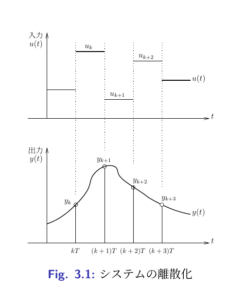

## 3.1 状態方程式の離散化

0.5 システム $$\begin{align}
 \frac{dx}{dt} &= A_c x(t) + B_c u(t) \label{c_state_eq} \\
 y(t)          &= C x(t) + D u(t) \label{c_output_eq}
\end{align}$$ を離散化することを考える．\
$T$ : サンプリングインターバル\
$x_k$ : 時刻$kT$における状態\
$y_k$ : 時刻$kT$における出力\
とし，\
入力$u(t)$は時刻$kT \leq t < (k+1)T$において$u(t) = u_k$とする．\
(Fig.[1](#fig_discrete_signal){reference-type="ref"
reference="fig_discrete_signal"}参照)

0.5

## 3.1 状態方程式の離散化

このようなシステムの$T$時間後（１サンプル時間後）の応答は，初期値$x(kT)$,積分区間$T$として，入力のある状態方程式の応答
$$\begin{align}
  x(t) = e^{At} x_0 + \int_0^t e^{A(t-\tau)} B u (\tau) d \tau
\end{align}$$ を用いれば $$\begin{equation}
 x(kT+T) = e^{A_c T} x(kT) 
  + \int_0^T e^{A_c(T - \tau)}B_c u (kT + \tau) d \tau
\end{equation}$$ と表される．ここで仮定より$u(kT+\tau)$,
$(0\leq\tau<T)$は一定値$u_k$であるから，
[離散化されたシステムの状態方程式と出力方程式]{style="color: blue"}は
$$\begin{align}
 x_{k+1} &= e^{A_cT} x_k 
  + \left( \int_0^T e^{A_c(T-\tau)} B_c d \tau \right) u_k \nonumber \\
 &= A x_k + B u_k \\
 y_k &= C x_k + D u_k
\end{align}$$ となる．

## 3.1 状態方程式の離散化

いま$A_c$の固有値を$\lambda_{c1}, \lambda_{c2},
\cdots \lambda_{cn}$とし，正則な複素行列$S$を $$\begin{align}
 S^{-1} A_c S 
  &=
  \left(\begin{array}{cccc}
         \lambda_{c1} & 0            & \cdots & 0 \\
     0            & \lambda_{c2} &        & 0 \\
     \vdots       &              & \ddots & \\
     0            & \cdots       &        & \lambda_{cn} 
    \end{array}\right) \nonumber \\
 &= \Lambda
\end{align}$$ を満たすように選ぶことができると仮定する ．
この$\Lambda$を用いれば $$\begin{align}
 A &=  e^{A_cT} \nonumber \\
 &= S e^{\Lambda T} S^{-1} \nonumber \\
 &=
  S \left(\begin{array}{cccc}
           e^{\lambda_{c1} T} & 0                  & \cdots & 0 \\
       0                  & e^{\lambda_{c2} T} &        & 0 \\
       \vdots             &                    & \ddots & \\
       0                  & \cdots             & & e^{\lambda_{cn} T}
      \end{array}\right)
  S^{-1}
\end{align}$$
となり，[**離散化されたシステムの$A$行列の固有値は$e^{\lambda_{ci} T}$**]{style="color: blue"}となる．

## 3.1 状態方程式の離散化

$$\begin{align}
 A &=  e^{A_cT} \nonumber \\
 &= S e^{\Lambda T} S^{-1} \nonumber \\
 &=
  S \left(\begin{array}{cccc}
           e^{\lambda_{c1} T} & 0                  & \cdots & 0 \\
       0                  & e^{\lambda_{c2} T} &        & 0 \\
       \vdots             &                    & \ddots & \\
       0                  & \cdots             & & e^{\lambda_{cn} T}
      \end{array}\right)
  S^{-1} \tag{3.7}
\end{align}$$
[**離散化されたシステムの$A$行列の固有値は$e^{\lambda_{ci} T}$**]{style="color: blue"}となる．
よって\
連続時間システムの[$A_c$行列の固有値の実部が負である]{style="color: blue"}\
$\Longrightarrow$
離散化されたシステムの[$A$行列の固有値の絶対値は1未満となる]{style="color: blue"}．\
これは後述するように連続システムが安定であれば離散化されたシステムも安定となることを示
している．

## 3.2 連続時間コントローラの離散化

特殊なシステムの場合は，先の離散化以外の方法で制御できる場合がある．\
例えば機械系の制御の場合はつぎのようにオブザーバを用いないで制御することができる．
一般に機械系の状態方程式は連続系において $$\begin{align}
 \frac{d}{dt}
  \left(\begin{array}{c}
         x_1 \\
     x_2 
    \end{array}\right)
  &=
  \left(\begin{array}{cc}
         0   & I \\
     K_1 & K_2
    \end{array}\right)
  \left(\begin{array}{c}
         x_1 \\
     x_2 
    \end{array}\right)
  +
  \left(\begin{array}{c}
         0 \\
     K_3
    \end{array}\right)
  u \\
 y &=
  \left(\begin{array}{cc}
         I & 0 
    \end{array}\right)
  \left(\begin{array}{c}
         x_1 \\
     x_2 
    \end{array}\right)
\end{align}$$ と表されることが多い． ここで $$\begin{align}
 x_1 &= y \\
 x_2 &= \frac{dy}{dt}
\end{align}$$ であることから，状態フィードバックは $$\begin{equation}
 u(t) = F_1 y + F_2 \frac{dy}{dt}
\end{equation}$$ で表される．

## 3.2 連続時間コントローラの離散化

ここで連続系の制御則 $$\begin{equation}
 u(t) = F_1 y + F_2 \frac{dy}{dt} \tag{3.12}
\end{equation}$$
に対して離散系の制御則として次の状態フィードバックを用いることを考える．
$$\begin{equation}
 u_k = F_1 y(kT) + F_2 \left.\frac{dy}{dt} \right\vert_{t = kT}
\end{equation}$$ このときは$\frac{dy}{dt}$を $$\begin{equation}
 \left.\frac{dy}{dt}\right\vert_{t = kT} = \frac{y_k - y_{k-1}}{T}
\end{equation}$$
で近似すれば[状態観測器を用いることなく]{style="color: blue"}状態フィードバックをすることが可能．\
出力の観測に雑音が多い場合には連続系の近似微分器$G_d(s)$
$$\begin{equation}
 G_d(s) = \frac{s}{Ts + 1}
\end{equation}$$ を離散化したものを用いて出力を近似微分した方が良い．

## 3.2 連続時間コントローラの離散化

いままで述べた連続時間コントローラの離散化は，
あくまでサンプリングインターバル$T$が十分小さいとして連続時間コントローラをディジタル計算機上で実現するものであった．

$\Downarrow$

サンプリングインターバルが長いと，[連続時間コントローラと同等の性能が得られない]{style="color: red"}場合がある．

$\Downarrow$

何らかの意味でディジタルコントローラの性能が連続時間コントローラの性能に近付くように，コントローラの離散化を工夫する[ディジタル再設計の問題]{style="color: blue"}
を考える必要がある．

